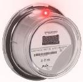
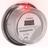
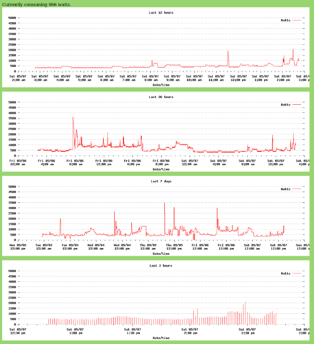
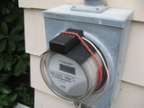
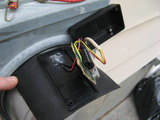

irmetermon -- electric utility meter reading using an AVR micro
============

*This project uses an AVR microcontroller and a phototransistor to
implement a circuit that allows reading power usage from some common
household electric meters.*

Many modern electric meters deployed in the US now have wireless
connectivity to enable the electric utility to read them from a
vehicle in the street, rather than requiring someone to approach
each meter physically.  While in principle one might be able to
get access to the meter's data via the electric utility's radio
interface, a) the equipment would be expensive, and b) the data
stream is likely (hopefully!) encrypted.

Whether for testing convenience, or required for calibration
purposes, these meters also all seem to be equipped with an
infrared LED that emits one pulse for every watt-hour consumed. 
(Think of this pulse as the modern equivalent of the spinning
disk that existed in older meters.)  Rather than trying to
use the radio interface, it's far, far, easier to simply watch
for pulses of the little IR led.  This project does just that.

I've played with two circuits for detecting the IR pulses using an IR
phototransistor.  One is dead simple, and the other works reliably.

Simple, but fussy
------------------
The first circuit, shown in [schematic.breakdetect.txt](
doc/schematic.breakdetect.txt), interfaces directly to a serial
port, and is quite simple.  The software to gather the input pulses
equally trivial -- the idea is to look for an ANSI "break" condition on
the serial port, which will occur once per pulse.  Using a unix tty
driver, a "break" conditions can be made to appear as if a NULL
character was received on the port.  Unfortunately, I wasn't able to
make that trivial circuit work across varying ambient light levels. 
I'd be pleased if someone could make this scheme work -- the absence
of a microcontroller makes this method much simpler, and therefore
more accessible to more people.  [ _Since writing this originally,
I've heard of one user who did implement this -- their meter is in a
dark location, which helped.  -pgf_ ]

Reliable
--------
The other (more successful) circuit ([schematic.adc.txt
](doc/schematic.adc.txt))
uses the A/D input of an Atmel AVR
micro to monitor the phototransistor's output, and does edge detection
in software to detect the pulses.  Applying some heuristics makes it
easier to ignore changes in ambient light.  Again, a serial interface
is used, though in this case actual ASCII messages carry information
about the the pulses.

Host logging
------------
The host side software in either case logs the number of pulses
(each representing a watt-hour consumed) per minute.  Charting
software (using gnuplot) makes those results visible on a
webpage.  The host s/w is split in two:  read_ir.c (or
read_ir_breakdetect.c for the simpler circuit) reads data from
the serial port, timestamps it, and forwards it across a pipe to
ir_meterlog.c, which does the logging.  Daily logs are kept on
both a 1 minute and 10 minute basis.  (While 1 minute logs are very
interesting on a daily basis, it probably makes more sense to archive
10 minute logs long-term.)  In addition, a simple file is continuously
maintained which records the current power consumption, based on the
timing of the most recent two pulses.

There are more detailed construction and operation notes in the
doc directory in [ "Installation" ]( doc/Installation ).

Acknowledgements
----------------
Thanks where thanks is due -- I was inspired to tackle this by
some earlier investigation into the IR LED by "Dave K", on his [ Tech Blog ](
http://davestech.blogspot.com/2008/02/itron-remote-read-electric-meter.html)
as well as by "blalor" who posted some [ scope trace pictures ](
http://www.flickr.com/photos/blalor/3876765214/in/photostream )

---------------------------------------

The (former) Blog.   sigh.
==========================
*The rest of this README has been reconstructed from backups of my
original sourceforge-hosted Wordpress project blog.  Since sourceforge
retired that service (without warning!!!!), this is all that's left.
It was all much prettier before.*

you can't change what you can't measure - _2011-04-28_
---------------------------------------

I've wanted to be able to "see" our household electricity usage
for a long time.  I confess, we probably use a lot of it -- I
have too many computers turned on in too many rooms, we heat the
sun porch (which we use for at least an hour a day all year long)
with electricity, and I'm a fan of a well-lit home.  But in my
own, small, misguided way, I'd like to conserve, and the only way
to change one's behavior is to know that that behavior _is_ in
the first place.

What I really want is a giant bar graph on the kitchen wall telling me
what our current electricity consumption is.  That's not going to
happen right away, but I've started down that road -- I'm building a
sensor that should give me the data, and I've cobbled together some
web-accessible graphs that should show me the trends I'm interested
in.

The sensor is based on something I discovered while [ surfing ](
http://davestech.blogspot.com/2008/02/itron-remote-read-electric-meter.html )
and [ googling ](
http://www.flickr.com/photos/blalor/3876765214/in/photostream ) a while ago:
many electric meters emit a brief infrared pulse every time you use a
watt-hour of energy.  If you're using 1000 watts, those pulses happen
every couple of seconds.

[ irmetermon ]( https://github.com/foxharp/irmetermon )
is my project to detect, log, and graph those pulses.

a picture is worth a 1000 watts - _2011-05-07_
-------------------------------

Most of the effort in irmetermon went into physical construction, and
the AVR firmware.  But at least some went into making the graphs look
nice.  Or, at least, presentable.

In the inline image below, the labels aren't clear.
[ Here's ]( pix/graph_5_7.png ) a full-size image, in a new window.

The regular bump every 2-1/4 hours is our (new) fridge.  The old
fridge had more frequent bumps, and they were twice as high.  The
spike at 11:30 saturday morning was the toaster.  The larger spike at
7:55am on friday was the electric heat taking the chill off the
sunporch.  Consumption was spiky friday afternoon, because we had a
contractor installing windows -- occasionally sawing and drilling, and
all the cellar lights were on as well.  (some of the anomalies in the
7-day chart, like 0 power for a time, are from missing or bogus data
during debugging.)

We're working on trying to figure out what makes up the "base" usage
of 400 or 500 watts.  Turns out it comes from several computers, the
garage door opener (3W), the stereo receiver that's always on (25W),
etc.  I've now hooked the stereo up to an X10 controller, so it should
be off more of the time.  I also realized that the outside lighting we
leave on overnight consumes almost 100 watts, even though it's on a
dimmer, and is set pretty low.  Guess we need to do something about
that.  [ _Since writing this, we've reduced the base load to 300W. 
-pgf 4/2013_ ]

build a monitor -- $20 or less - _2011-05-12_
------------------------------

Building a power meter like the one I've built is really pretty
easy.  If you've worked with microcontrollers, especially Atmel's
AVR line of micros, before, it's especially easy.  I also suspect
the code could be ported in some form or other to an Arduino,
which would let you use that whole family of tools as well.

But I'm not going to go the "gory details" route.  The code includes a
[ README ]( README ) and some [ installation notes ]( doc/Installation )
that sketch the rough outlines, and I'll let you take it from there.

I do have some pictures that might help.  The assembled detector
for the IR pulses that the electric meter is constantly putting
out looks like this:  [ (larger) ]( pix/pic_3.html )

The box holds some minimal electronics (14 pin AVR micro, a resistor,
a capacitor, and a phototransistor), the piece of rubber shades the
meter, and the bungee cord holds it all together in a most attractive
way.  Okay, I was kidding about the last part.

Inside, it looks like this:
 [ (larger) ]( pix/pic_6.html )

It's really pretty simple.  There are more pictures [ here. ]( pix/index.html )

The other end of the wire connects to a serial-to-USB converter. 
I used one from sparkfun, because it was easy to connect to.  I
don't have a picture of that, but it's an older version of
[ this ]( http://www.sparkfun.com/products/9873 ).

It all gets even easier (you can avoid much (but not all) of the
soldering, and the need for the separate serial to USB converter,
if you use a USB-capable AVR chip.  I prototyped the detector
using a [ breakout board ]( http://ladyada.net/products/atmega32u4breakout )
from Adafruit Industries, which was a pleasure to use. 
(And how can you not like a product designed by a recent
[ Wired magazine ]( http://www.wired.com/magazine/19-04 ) cover story? 

similar power monitor projects - _2011-05-14_
------------------------------

Obviously I'm not the first to do a project like irmetermon.  In
the hopes of making someone else's search easier, I thought I'd
share links to the ones that I found earlier, as well as to the
ones I only learned of from the [ hackaday.com ](
 http://hackaday.com/2011/05/13/monitor-your-homes-power-usage-on-the-cheap )
comment page.

First up, the projects most similar to mine -- these all detect
the infrared pulses from the IR LED in the meter.:

- This fellow's meter is outdoors, and the pipeworks he
    constructed to allow supporting the detector in front of the
    meter without actually _attaching_ to the meter is a
    sight to behold.  He also built a really great home-made
    analog gauge to use as an output device.
    http://andres-leon.blogspot.com/2010/02/measuring-my-electricity-consumption.html

- This project appears to be installed indoors (at least, I
    assume so, since the detector is just taped to the meter!). 
    He's done some nice-looking Windows UI, but I don't think he
    shares that code.  Http://www.avbrand.com/projects/powermonitor 

- The next one is nice in that it makes use of the PPS
    (pulse-per-second) facility in modern kernels.  PPS is
    normally used to synchronize to high-accuracy timebases
    (mostly GPS devices), but I guess it can be used to get
    accurate timings on any sort of pulses.  Slick.
    http://phk.freebsd.dk/Eldims

- Here's a nice implementation, using IR phototransistors
    salvaged from an old mouse, and wired in parallel:
    http://blog.docstech.net/2010/09/13/electricity-consumption-monitor-a-step-forward

- I just got a comment today (on a previous post) from someone
    in the Netherlands who implemented irmetermon using the
    "break detect" scheme.  Their meter is indoors, so it works
    fine for them.  I'm thrilled that I've prompted and helped
    someone else start watching (and therefore, almost certainly
    reducing) their power consumption.

And let's not forget the folks that don't have flashing LEDs on
their meters, but still have spinning disks.  You can monitor
those too, but it's trickier.  I only found one project that
attempts to do that:  http://letsmakerobots.com/node/23875

Then there are projects that don't use the infrared LED, but
instead measure current into the house with "current clamp"
probes.  By their nature, these projects require a little more
care and respect for the high voltages and currents present in a
household breaker box.  Advantage are that they work from inside
the house without access to the meter, and the readings are more
immediate -- no waiting for a pulse, in order to do timing.  (If
your house is only consuming 350 watts, the IR pulses are 10
seconds apart, so there's some delay before you'll observe a
change.)

- This one uses just two probes (one for each incoming phase): 
    http://hackaday.com/2010/12/21/clamp-sensor-power-monitoring

- And another:
    http://www.picobay.com/projects/2009/01/real-time-web-based-power-charting.html

- Ed Cheung's system uses homemade current probes.  Knowing
    Ed's other projects, this doesn't surprise me.
    http://www.edcheung.com/automa/power.htm

- Here's a link to someone's _really_ complete
    monitoring setup -- they have a current probe on every
    circuit in their house.  Overkill for my needs, but I
    may understand the compulsion.
    http://www.kondra.com/circuit/circuit.html

And then of course there are the commercial offerings.  There are lots
of these.  You pay for packaging, convenience, hopefully slick UI
features, etc.  If you go this route, be sure you can get access to
your data.  With the Radio Shack product, for instance (EM100B), you
won't pay much (under $30 at amazon) but you don't get access to the
data other than through the provided display -- no computer interface,
no graphs.

One company deserves special mention (and not only because they
self-promoted themselves in the hackaday comments -- grrr.).  They
seem to be selling something that does exactly what irmetermon and the
rest of the inexpensive products listed above do, and in the same way,
but for $250.  And on top of that they seem to take your data and then
charge you $9 a month to view it.  Not my kind of product, I'm afraid. 
Compare that to another popular product that simply makes all the data
available in XML format, and gives you an interface to Google
powermeter along with it.

Oh -- speaking of Google's powermeter [ _Now defunct -pgf_ ] -- here's
a set of instructions for how to hook your home-brew metering up to
Google's monitoring API.  I haven't done this (and probably won't) but
I thought it was interesting.  (Complicated, but interesting.)
http://mosquitto.org/2010/06/google-powermeter-step-by-step/

